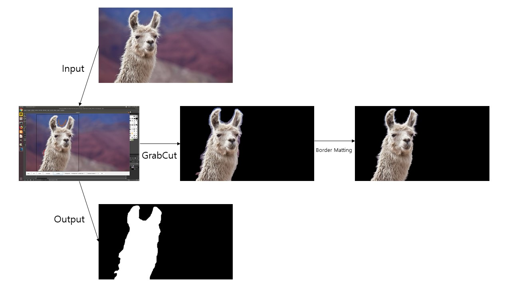

# GrabCut-Qt

2019-Winter Ajou University Visual Computing Lab. Individual Project

Phis is a python implementation of [GrabCut](http://cvg.ethz.ch/teaching/cvl/2012/grabcut-siggraph04.pdf).

Implementation by python library(PIL, opencv-python, numpy, PyQt, sklearn)

I refer to this code. 

https://github.com/ahaque/cs231b/tree/master/project1

https://github.com/ahckjhckxz/grabcut-bordermatting

You can run at command line

$ python grabcut_qt.py

